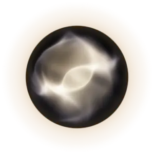
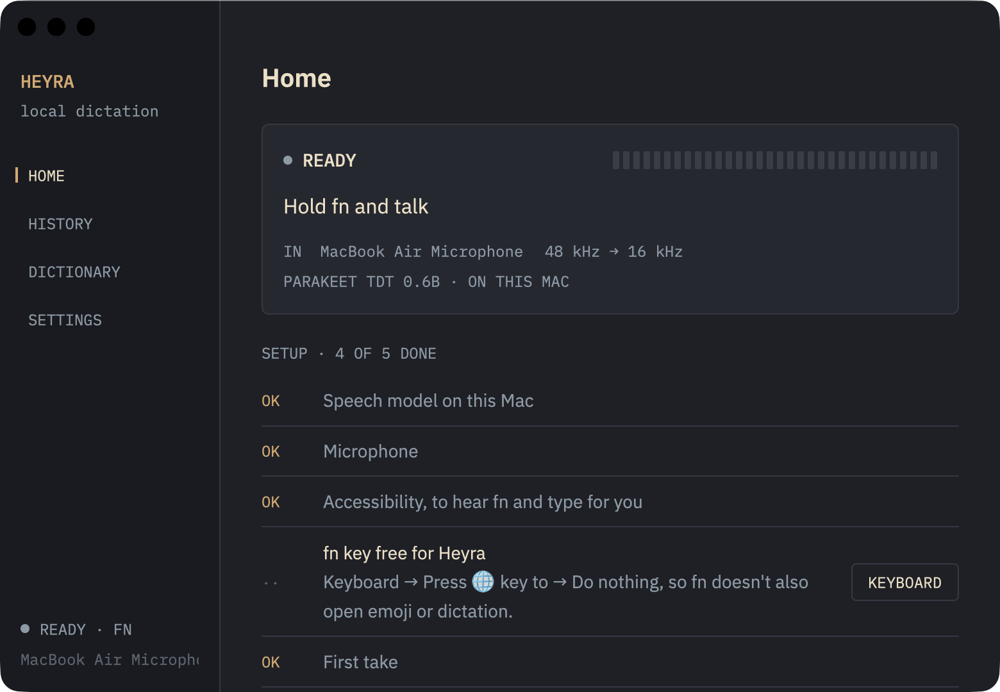

<p align="center"></p>

# Heyra

Hold **fn**, talk, let go. Your words are typed wherever your cursor is.

Heyra turns speech into text on your own Mac with NVIDIA's Parakeet model. It goes
online once, to download the model on first launch. After that your voice and your
words never leave the machine. No account, no subscription.

> **Proof of concept.** macOS on Apple Silicon only, for now.



## Install

1. With [Homebrew](https://brew.sh):

   ```sh
   brew install --cask alcun/tap/heyra
   ```

   Or download `Heyra.zip` from [Releases](https://github.com/alcun/heyra-desktop/releases),
   unzip it and move **Heyra** to Applications. It isn't notarized by Apple yet, so the
   first time macOS blocks it: System Settings → Privacy & Security → **Open Anyway**.
2. Open Heyra from Applications. It also opens at login from now on (Settings can turn
   that off).
3. Heyra opens on Home with a short setup list. It ticks each step off as you go:
   - the speech model downloads (about 490 MB, once)
   - allow the microphone
   - turn on Heyra under Privacy & Security → Accessibility, so it can hear fn and type
   - set Keyboard → Press 🌐 key to → **Do nothing**, so fn doesn't also open emoji
4. Click into any text box, hold fn, say something, let go.

Heyra lives in the menu bar and as a small dark dot at the bottom of the screen. Click
the dot, or use the menu bar, to open your history and settings.

## What it does

- **Push to talk.** Hold fn. A glowing orb at the bottom of the screen shows it's
  listening. Let go and the text is pasted in, and your clipboard text is put back.
  Pressing another key while holding fn (fn+arrow, fn+delete) cancels the take.
  A soft click marks the start and end of each take.
- **Hands-free.** Double-tap fn to start, tap fn once (or the ✓ by the orb) to stop and
  paste. The ✕ stops without pasting; the text is still kept in History.
- **Long takes.** Talk for up to 30 minutes in one go; long takes are written a minute
  at a time, about 5 s of writing per minute of speech.
- **Updates.** `brew upgrade --cask heyra`.
- **Fast.** Six seconds of speech becomes text in about 0.4 s on an M-series Mac.
- **Light.** About 2% of one CPU core at rest and 5% while you talk. The model stays
  loaded (about 1.3 GB of memory) so it's ready the moment you press fn.
- **History.** Every take is kept on your Mac. Click one to copy it again.
- **Dictionary.** Fix words it mishears: `a cappy bar => capybara`.
- **Any microphone.** Pick one in Settings.
- **TING.** A Teenage Engineering EP-2350 works as a push-to-talk mic through
  [ting-wispr](https://github.com/alcun/ting-wispr): its squeeze sends ctrl+opt+F12,
  which Heyra also listens for.

Everything Heyra keeps is in `~/Library/Application Support/Heyra`.

## Build from source

You need Rust (`rustup`) and Xcode's command line tools.

```sh
git clone https://github.com/alcun/heyra-desktop.git
cd heyra-desktop
./bundle.sh            # builds target/Heyra.app
open target/Heyra.app
```

`bundle.sh` signs with your Apple Development certificate if you have one, so macOS
keeps your permissions between builds. Without one it signs ad hoc, and macOS will ask
for Accessibility again after each rebuild.

`target/release/heyra --file clip.wav` prints a transcript, to test the engine.

## How it works

- [GPUI](https://www.gpui.rs) for the interface (the framework Zed is built with).
- [sherpa-onnx](https://github.com/k2-fsa/sherpa-onnx) runs Parakeet TDT 0.6B v3 (int8)
  in the app itself. 25 languages.
- A macOS event tap watches for fn, `cpal` records the microphone, and the text is
  pasted with a real ⌘V.

The model is downloaded from this repository's releases, with the sherpa-onnx release
as a fallback, and checked against a SHA-256 before use.

## Credits and licence

Heyra is MIT licensed. The model, runtime and fonts have their own licences; see
[NOTICE](NOTICE).
